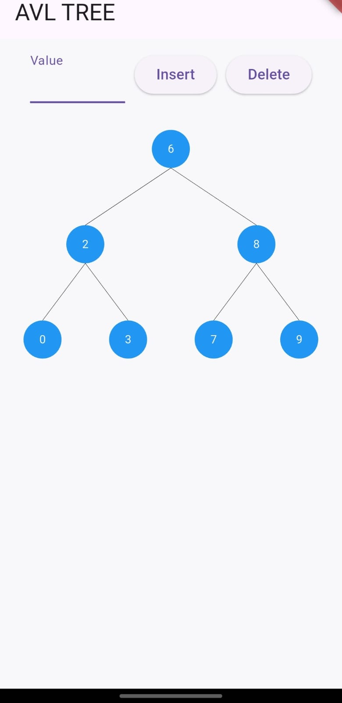

# 🌳 AVL Tree Visualizer  



## 📖 About  
AVL Tree Visualizer is a mobile application that demonstrates AVL tree insertion and deletion operations with real-time visualization. The app helps students and developers understand how AVL trees maintain balance through rotations.  

## ✨ Features  
✅ Interactive visualization of AVL tree insertions and deletions  
✅ Real-time balancing with left and right rotations (LL, RR, LR, RL)  
✅ Clean and intuitive UI  
✅ Great for learning AVL trees and self-balancing binary search trees  

## 🛠️ Technologies Used  
- **Flutter** (for cross-platform mobile development)  
- **Dart** (programming language)  

## 📚 What is an AVL Tree?  
An **AVL tree** is a self-balancing binary search tree (BST) where the height difference (balance factor) between the left and right subtrees is at most **1**. If an imbalance occurs after insertion or deletion, the tree performs rotations to restore balance. This ensures **O(log n)** time complexity for search, insertion, and deletion.  

## 🚀 Getting Started  

### 1️⃣ Clone the Repository  
```sh  
git clone https://github.com/J-s-v-n/AVL_TREE.git  
cd AVL_TREE  
```

### 2️⃣ Install Dependencies  
Ensure you have Flutter installed, then run:  
```sh  
flutter pub get  
```

### 3️⃣ Run the App  
To run the app on an emulator or physical device:  
```sh  
flutter run  
```

## 🏆 Contributing  
Contributions are welcome! Feel free to fork the repo, create a branch, and submit a pull request.  


